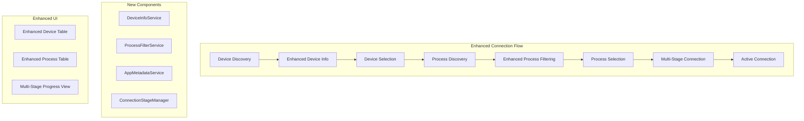

# Design Document

## Overview

This design enhances the TowerIQ connection flow by improving device information display, filtering processes more intelligently, providing clearer app identification with metadata, and implementing a transparent multi-stage connection process. The solution addresses current UX issues while maintaining the existing PyQt6/qasync architecture and service-oriented design patterns.

## Architecture

### Current Architecture Integration

The enhancement builds upon TowerIQ's existing architecture:
- **Service Layer**: EmulatorService and FridaService handle device/process operations
- **Session Management**: SessionManager maintains reactive state with PyQt signals
- **GUI Layer**: ConnectionPanel provides multi-stage UI with QStackedWidget
- **Communication**: PyQt signals/slots for reactive UI updates

### Enhanced Components



## Components and Interfaces

### 1. Enhanced Device Information Service

**Purpose**: Gather comprehensive device metadata for better identification

```python
class DeviceInfoService:
    async def get_enhanced_device_info(self, device_id: str) -> Dict[str, Any]:
        """Get comprehensive device information including model, Android version, etc."""
        
    async def get_device_properties(self, device_id: str, properties: List[str]) -> Dict[str, str]:
        """Get specific device properties via getprop"""
        
    def format_device_status(self, raw_status: str) -> str:
        """Convert ADB status to user-friendly format (Connected -> Online)"""
```

**Integration**: Extends EmulatorService with additional metadata gathering

### 2. Enhanced Process Filtering Service

**Purpose**: Intelligently filter and enrich process information

```python
class ProcessFilterService:
    def __init__(self, adb_wrapper: AdbWrapper, logger):
        self.system_package_patterns = [
            'com.google.android.*',
            'com.android.*',
            'android.*',
            'com.qualcomm.*',
            'com.samsung.android.*'
        ]
    
    async def get_filtered_processes(self, device_id: str) -> List[Dict[str, Any]]:
        """Get only third-party running applications with metadata"""
        
    def is_system_package(self, package_name: str) -> bool:
        """Determine if package is a system package to be filtered out"""
        
    async def enrich_process_info(self, device_id: str, process_data: Dict) -> Dict[str, Any]:
        """Add app display name, icon, and other metadata to process info"""
```

**Integration**: Enhances EmulatorService.get_installed_third_party_packages()

### 3. App Metadata Service

**Purpose**: Retrieve app display names, icons, and store metadata

```python
class AppMetadataService:
    async def get_app_display_name(self, device_id: str, package_name: str) -> str:
        """Get human-readable app name from package manager"""
        
    async def get_app_icon_data(self, device_id: str, package_name: str) -> Optional[bytes]:
        """Extract app icon as PNG data"""
        
    async def get_app_metadata(self, device_id: str, package_name: str) -> Dict[str, Any]:
        """Get comprehensive app metadata (name, version, icon, etc.)"""
```

**Implementation Strategy**:
- Use `dumpsys package` for app labels and metadata
- Extract icons via `aapt dump badging` or direct APK analysis
- Cache metadata to avoid repeated ADB calls
- Fallback to package name if display name unavailable

### 4. Connection Stage Manager

**Purpose**: Orchestrate and track multi-stage connection process

```python
class ConnectionStageManager:
    def __init__(self, session_manager: SessionManager, logger):
        self.stages = [
            'device_selection',
            'process_selection', 
            'frida_server_check',
            'frida_server_install',
            'frida_server_start',
            'frida_server_verify',
            'hook_compatibility_check',
            'process_attachment',
            'script_injection',
            'connection_active'
        ]
    
    async def execute_connection_flow(self, device_id: str, process_info: Dict) -> bool:
        """Execute complete connection flow with stage tracking"""
        
    async def execute_stage(self, stage_name: str, **kwargs) -> bool:
        """Execute individual stage with error handling and retry logic"""
        
    def update_stage_status(self, stage: str, status: str, message: str = ""):
        """Update session manager with current stage status"""
```

**Stage Definitions**:
1. **frida_server_check**: Verify if Frida server is already running
2. **frida_server_install**: Download and push Frida server binary
3. **frida_server_start**: Start Frida server process
4. **frida_server_verify**: Test Frida server responsiveness
5. **hook_compatibility_check**: Validate hook script compatibility
6. **process_attachment**: Attach Frida to target process
7. **script_injection**: Inject and load hook script

## Data Models

### Enhanced Device Information

```python
@dataclass
class EnhancedDeviceInfo:
    serial: str
    model: str
    android_version: str
    api_level: int
    architecture: str
    status: str  # "Online", "Offline", "Unauthorized"
    manufacturer: str
    device_name: str
    is_emulator: bool
    connection_type: str  # "USB", "Network"
```

### Enhanced Process Information

```python
@dataclass
class EnhancedProcessInfo:
    package_name: str
    display_name: str
    version_name: str
    version_code: int
    pid: int
    is_running: bool
    icon_data: Optional[bytes]
    install_time: Optional[datetime]
    last_update_time: Optional[datetime]
    is_debuggable: bool
```

### Connection Stage Status

```python
@dataclass
class ConnectionStageStatus:
    stage_name: str
    status: str  # "pending", "active", "completed", "failed", "skipped"
    message: str
    progress_percent: Optional[int]
    error_details: Optional[str]
    retry_count: int
    start_time: Optional[datetime]
    end_time: Optional[datetime]
```

## Error Handling

### Enhanced Error Categories

1. **Device Information Errors**
   - Property retrieval failures
   - Unsupported device types
   - Permission issues

2. **Process Filtering Errors**
   - Package manager access failures
   - Metadata extraction failures
   - Icon retrieval failures

3. **Connection Stage Errors**
   - Frida server installation failures
   - Network connectivity issues
   - Process attachment failures
   - Script compatibility issues

### Error Recovery Strategies

```python
class ConnectionErrorHandler:
    def __init__(self, session_manager: SessionManager, logger):
        self.retry_strategies = {
            'network_timeout': ExponentialBackoffRetry(max_attempts=3),
            'frida_server_start': LinearRetry(max_attempts=2, delay=1.0),
            'process_attachment': SingleRetry(delay=0.5)
        }
    
    async def handle_stage_error(self, stage: str, error: Exception) -> bool:
        """Handle stage-specific errors with appropriate retry strategy"""
        
    def get_user_friendly_error_message(self, error: Exception) -> str:
        """Convert technical errors to user-friendly messages"""
```

## Testing Strategy

### Unit Testing

1. **Device Information Service Tests**
   - Mock ADB responses for various device types
   - Test property parsing and formatting
   - Verify error handling for unavailable properties

2. **Process Filtering Service Tests**
   - Test system package detection patterns
   - Verify third-party app filtering
   - Test metadata enrichment with various app types

3. **Connection Stage Manager Tests**
   - Test individual stage execution
   - Verify error handling and retry logic
   - Test stage progression and rollback

### Integration Testing

1. **End-to-End Connection Flow**
   - Test complete flow with real devices
   - Verify UI updates during stage progression
   - Test error scenarios and recovery

2. **Device Compatibility Testing**
   - Test with various Android versions
   - Test with different emulator types
   - Verify metadata extraction across device types

### UI Testing

1. **Enhanced Table Display**
   - Verify device information formatting
   - Test process filtering and display
   - Validate icon display and fallbacks

2. **Multi-Stage Progress View**
   - Test stage progression visualization
   - Verify error state display
   - Test retry and cancellation functionality

## Implementation Phases

### Phase 1: Enhanced Device Information
- Implement DeviceInfoService
- Update device table with additional columns
- Add device property gathering methods

### Phase 2: Process Filtering Enhancement
- Implement ProcessFilterService and AppMetadataService
- Update process filtering logic
- Add app display name and icon support

### Phase 3: Multi-Stage Connection Flow
- Implement ConnectionStageManager
- Create enhanced progress UI
- Add stage-specific error handling

### Phase 4: Polish and Testing
- Comprehensive testing across device types
- Performance optimization
- UI/UX refinements

## Performance Considerations

1. **Metadata Caching**: Cache device properties and app metadata to reduce ADB calls
2. **Async Operations**: All ADB operations remain asynchronous to prevent UI blocking
3. **Icon Optimization**: Compress and cache app icons, implement lazy loading
4. **Stage Parallelization**: Execute independent stages in parallel where possible

## Security Considerations

1. **ADB Security**: Validate all ADB command inputs to prevent injection
2. **Icon Handling**: Sanitize icon data and implement size limits
3. **Error Information**: Avoid exposing sensitive system information in error messages
4. **Resource Limits**: Implement timeouts and resource limits for all operations