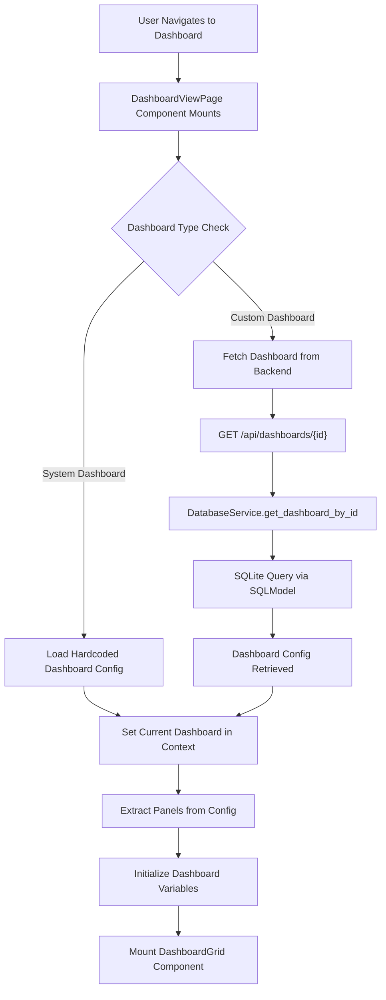
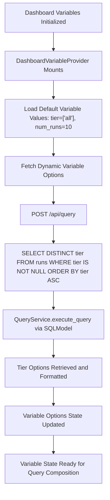
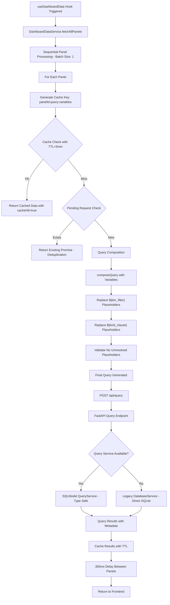
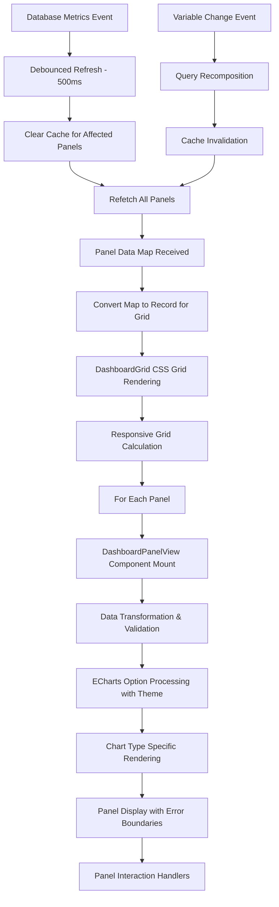

# TowerIQ Dashboard Data Flow Analysis

## Overview

This document provides a comprehensive analysis of the entire data flow process when navigating to and loading a dashboard in TowerIQ. The system employs a sophisticated architecture with React frontend, FastAPI backend, caching mechanisms, debouncing, and dynamic query composition.

**Last Updated:** Based on current system analysis as of December 2024
**Status:** Current implementation - ready for hierarchical refactoring

## Current Architecture Components

### Frontend Components
- **React/Tauri GUI**: Primary user interface built with Material-UI
- **DashboardViewPage**: Main dashboard component handling navigation and loading
- **DashboardContext**: Dashboard state management with CRUD operations
- **DashboardDataService**: Centralized data fetching with intelligent caching and batching
- **DashboardVariableContext**: Variable management with dynamic options loading
- **useDashboardData Hook**: Dashboard-level data fetching with error handling
- **DashboardGrid**: CSS Grid-based panel rendering with responsive layout
- **DashboardPanelView**: Individual panel rendering with ECharts integration

### Backend Components
- **FastAPI API Server** (`api_server.py`): REST API endpoints for dashboards and queries
- **DatabaseService**: SQLite database operations with connection pooling
- **QueryService**: Type-safe query execution using SQLModel
- **Dashboard Models**: SQLModel-based type-safe data models
- **ConfigurationManager**: Application configuration management

### Data Flow Architecture
- **Hierarchical Structure**: Currently flat with scattered responsibilities
- **Caching Strategy**: Service-level caching with TTL and deduplication
- **Variable System**: Context-based with dynamic query composition
- **Panel Management**: Individual components with shared data service

## Current System Data Flow Process

### Phase 1: Dashboard Navigation and Loading



### Phase 2: Variable Processing and Options Loading



### Phase 3: Panel Data Fetching with Intelligent Caching



### Phase 4: Data Processing and Rendering



## Key API Endpoints

### Dashboard Management
- `GET /api/dashboards` - List all dashboards
- `GET /api/dashboards/{id}` - Get specific dashboard
- `POST /api/dashboards` - Create new dashboard
- `PUT /api/dashboards/{id}` - Update dashboard
- `DELETE /api/dashboards/{id}` - Delete dashboard

### Data Querying
- `POST /api/query` - Execute SQL queries with variables
- `POST /api/query/preview` - Preview query execution plan

### Database Operations
- `GET /api/v1/database/statistics` - Get database statistics
- `POST /api/v1/database/collect-metrics` - Trigger metrics collection

## Caching and Performance Optimization

### Current DashboardDataService Implementation
```typescript
interface PanelDataResult {
  data: any[];
  loading: boolean;
  error: string | null;
  timestamp: number;
  cacheHit: boolean;
}

interface DashboardDataServiceConfig {
  batchSize: number;           // Currently: 1 (sequential loading)
  delayBetweenRequests: number; // Currently: 100ms
  delayBetweenBatches: number;  // Currently: 300ms
  cacheTTL: number;            // Currently: 5 minutes
  maxRetries: number;          // Currently: 1 (no retries)
  retryDelay: number;          // Currently: 1000ms
}
```

**Current Cache Configuration:**
- **TTL**: 5 minutes (300,000ms)
- **Batch Size**: 1 (changed from 6 for better error isolation)
- **Delay Between Panels**: 300ms (increased for stability)
- **Delay Between Requests**: 100ms
- **Max Retries**: 1 (immediate failure for better UX)
- **Request Deduplication**: Active with pending request map

**Cache Key Generation:**
```typescript
private generateCacheKey(panelId: string, query: string, variables: Record<string, any>): string {
  const variablesString = JSON.stringify(variables, Object.keys(variables).sort());
  return `${panelId}:${query}:${variablesString}`;
}
```

**Key Features:**
- **Intelligent Error Handling**: Unresolved placeholder detection
- **Sequential Loading**: Prevents cascade failures
- **Cache Management**: TTL-based with manual clearing
- **Development Logging**: Detailed debugging information
- **Response Validation**: HTTP status and JSON parsing

### Current Request Management
- **Deduplication**: `pendingRequests` Map prevents duplicate requests
- **Error Isolation**: Single panel failures don't block others
- **Cache Validation**: TTL-based expiration with timestamp checking
- **Memory Management**: Automatic cleanup of pending requests
- **Placeholder Validation**: Pre-request validation of query composition

### Debouncing Mechanisms

#### Database Metrics Updates
```typescript
// 500ms debounce for database metrics updates
const handleDatabaseMetricsUpdate = () => {
  clearTimeout(debounceTimer);
  debounceTimer = setTimeout(() => {
    refetch();
  }, 500);
};
```

#### Device Cache
```typescript
// 5-second cache for device discovery
const _device_cache_duration = 5; // seconds
```

## Query Composition and Variable Processing

### Variable Substitution
The `composeQuery` function handles dynamic SQL generation:

```typescript
export function composeQuery(rawQuery: string, variables: Record<string, any>): string {
  let finalQuery = rawQuery;

  // Handle tier filter
  const tierValue = variables.tier;
  if (finalQuery.includes('${tier_filter}')) {
    let tierClause = '';
    if (Array.isArray(tierValue) && tierValue.length > 0 && !tierValue.includes('all')) {
      const safeTiers = tierValue.map(t => typeof t === 'number' ? t : `'${String(t)}'`).join(',');
      tierClause = finalQuery.toLowerCase().includes('where') 
        ? `AND tier IN (${safeTiers})`
        : `WHERE tier IN (${safeTiers})`;
    }
    finalQuery = finalQuery.replace('${tier_filter}', tierClause);
  }

  // Handle limit clause
  const limitValue = variables.num_runs;
  if (finalQuery.includes('${limit_clause}')) {
    let limitClause = '';
    if (limitValue && limitValue !== 'all') {
      limitClause = `LIMIT ${parseInt(String(limitValue), 10)}`;
    }
    finalQuery = finalQuery.replace('${limit_clause}', limitClause);
  }

  return finalQuery.replace(/\s+/g, ' ').trim();
}
```

### Example Query Transformation
**Original Query:**
```sql
SELECT row_number() OVER (ORDER BY start_time ASC) as run_number, round_coins, CPH, tier 
FROM runs ${tier_filter} 
ORDER BY start_time ASC ${limit_clause}
```

**With Variables** `{tier: [1,2], num_runs: 10}`:
```sql
SELECT row_number() OVER (ORDER BY start_time ASC) as run_number, round_coins, CPH, tier 
FROM runs AND tier IN (1,2) 
ORDER BY start_time ASC LIMIT 10
```

## Current Dashboard Types and Loading Strategy

### System Dashboards (Hardcoded - Frontend)
- **default-dashboard**: TowerIQ Overview with dual-axis charts
- **database-health-dashboard**: Database Health & Usage metrics
- **live-run-tracking-dashboard**: Real-time run tracking

**Loading Method:**
- Loaded directly from TypeScript configuration files (`/src/gui/TowerIQ/src/config/`)
- No backend API calls required
- Immediate availability with predefined panel configurations
- ECharts options pre-configured with theme integration

### Custom Dashboards (Database-Stored)
- **Storage**: SQLite database via SQLModel
- **Loading**: Backend API calls to `/api/dashboards/{id}`
- **CRUD Operations**: Full create, read, update, delete support
- **Schema**: Structured with panels, variables, metadata

### Dashboard Context Management
- **State Management**: React Context with CRUD operations
- **Current Dashboard**: Global state for active dashboard
- **Error Handling**: Comprehensive error states and recovery
- **Loading States**: Granular loading indicators

## Error Handling and Fallbacks

### Query Execution
1. **Primary**: SQLModel QueryService (type-safe)
2. **Fallback**: Legacy DatabaseService (direct SQLite)
3. **Schema Errors**: Graceful handling with empty results for missing columns

### Retry Logic
```typescript
// Single retry attempt with exponential backoff
for (let attempt = 1; attempt <= this.config.maxRetries; attempt++) {
  try {
    // Execute query
  } catch (error) {
    if (attempt < this.config.maxRetries) {
      await this.delay(this.config.retryDelay * attempt);
    }
  }
}
```

## Current Performance Characteristics

### Loading Strategy (Current)
- **Sequential Processing**: Panels loaded one by one (batch size = 1)
- **Delay Between Panels**: 300ms for stability
- **Error Isolation**: Single panel failures don't block others
- **Request Deduplication**: Prevents duplicate concurrent requests

### Memory Management
- **Cache TTL**: 5-minute automatic expiration
- **Pending Request Cleanup**: Automatic cleanup after completion
- **Variable Options Cache**: Dynamic tier options with refresh
- **Component Memoization**: React.memo for grid and panel components

### Event-Driven Updates
- **Database Metrics**: 500ms debounced refresh on metrics updates
- **Variable Changes**: Immediate cache invalidation and refetch
- **Manual Refresh**: Toolbar-triggered full dashboard reload
- **Responsive Updates**: Automatic layout adjustment on breakpoint changes

### Current Performance Bottlenecks
1. **Sequential Loading**: Could benefit from intelligent batching
2. **Context Re-renders**: Multiple contexts cause unnecessary updates
3. **Cache Granularity**: Panel-level caching could be more sophisticated
4. **Variable Propagation**: Complex context chain for variable updates

## Security Considerations

### Query Safety
- Only SELECT statements allowed
- Forbidden keywords: DROP, DELETE, UPDATE, INSERT, CREATE, ALTER, TRUNCATE
- Automatic LIMIT clause injection (500 rows max)
- Variable sanitization in query composition

### Input Validation
- Type checking for dashboard variables
- SQL injection prevention
- Parameter validation for API endpoints

## Current Configuration Architecture

### DashboardDataService Configuration (Current)
```typescript
interface DashboardDataServiceConfig {
  batchSize: number;           // Current: 1 (sequential)
  delayBetweenRequests: number; // Current: 100ms
  delayBetweenBatches: number;  // Current: 300ms
  cacheTTL: number;            // Current: 5 minutes (300,000ms)
  maxRetries: number;          // Current: 1 (no retries)
  retryDelay: number;          // Current: 1000ms
}
```

### System Configuration Layers
- **Frontend Environment**: API base URL, development flags
- **Backend Configuration**: Database paths, connection settings
- **Dashboard Definitions**: TypeScript configs vs database storage
- **Variable Defaults**: Hardcoded in DashboardVariableProvider
- **Theme Integration**: Material-UI theme with custom TowerIQ colors

### Configuration Inconsistencies (Refactoring Targets)
1. **Mixed Storage**: System dashboards in TS files, custom in database
2. **Variable Definitions**: Scattered across components and contexts
3. **Default Values**: Hardcoded in multiple locations
4. **Service Configuration**: Singleton pattern with limited flexibility

---

**Document Status**: Updated with current implementation analysis  
**Next Steps**: Review proposed hierarchical structure and begin refactoring planning  
**Key Focus Areas**: Dashboard class hierarchy, unified configuration, simplified contexts

## Monitoring and Debugging

### Development Mode Features
- Cache hit/miss logging
- Query execution timing
- Panel data flow tracing
- Grid layout debugging

### Production Monitoring
- Error tracking for failed queries
- Performance metrics collection
- Database health monitoring
- Automatic backup scheduling

## Current System Analysis Summary

The TowerIQ dashboard system implements a sophisticated but **distributed architecture** that balances performance, reliability, and user experience. 

### Current Strengths
1. **Intelligent Caching**: Multi-level caching with TTL and request deduplication
2. **Error Isolation**: Sequential loading prevents cascade failures
3. **Dynamic Query Generation**: Flexible variable substitution with placeholder validation
4. **Type Safety**: SQLModel integration for backend data operations
5. **Responsive Design**: CSS Grid with breakpoint-aware layout
6. **Real-time Updates**: Event-driven refresh with 500ms debouncing
7. **Security**: SQL injection protection and query validation

### Current Architectural Challenges (Refactoring Opportunities)
1. **Scattered Responsibilities**: Dashboard logic spread across multiple contexts and services
2. **Flat Hierarchy**: No clear object-oriented structure for dashboards/panels
3. **Context Proliferation**: Multiple React contexts managing related state
4. **Service Fragmentation**: Data fetching logic distributed across hooks and services
5. **Configuration Inconsistency**: Mix of hardcoded and database-stored dashboards
6. **Variable Management**: Complex context-based variable handling

### Recommended Refactoring Direction
Move toward a **hierarchical, object-oriented structure**:
- **DashboardManager**: Single entry point for all dashboard operations
- **Dashboard Class**: Individual dashboard instances with encapsulated panels and variables
- **Panel Class**: Self-contained panel objects with query, data, and rendering logic
- **Variable System**: Integrated variable management within dashboard instances
- **Unified Configuration**: Consistent storage and loading strategy

This architecture enables responsive dashboard loading while maintaining data consistency and system performance, but would benefit significantly from hierarchical refactoring to improve maintainability and extensibility.

## Proposed Hierarchical Refactoring Structure

### Target Architecture Overview

```typescript
// Proposed hierarchical structure
class DashboardManager {
  private dashboards: Map<string, Dashboard>
  private dataService: DashboardDataService
  private variableService: VariableService
  
  // Central dashboard management
  getDashboard(id: string): Dashboard
  createDashboard(config: DashboardConfig): Dashboard
  deleteDashboard(id: string): boolean
}

class Dashboard {
  private panels: Map<string, Panel>
  private variables: DashboardVariables
  private metadata: DashboardMetadata
  private dataCache: DashboardCache
  
  // Dashboard-level operations
  loadData(): Promise<void>
  refreshData(): Promise<void>
  updateVariable(name: string, value: any): void
  addPanel(panel: Panel): void
  removePanel(panelId: string): void
}

class Panel {
  private query: QueryDefinition
  private visualization: VisualizationConfig
  private data: PanelData
  private layout: GridPosition
  
  // Panel-level operations
  fetchData(variables: VariableSet): Promise<PanelData>
  updateQuery(query: string): void
  updateVisualization(config: VisualizationConfig): void
}

class DashboardVariables {
  private definitions: Map<string, VariableDefinition>
  private values: Map<string, any>
  private options: Map<string, VariableOption[]>
  
  // Variable management
  updateValue(name: string, value: any): void
  getComposedQuery(rawQuery: string): string
  loadDynamicOptions(): Promise<void>
}
```

### Refactoring Benefits

1. **Clear Hierarchy**: Dashboard → Panels → Data/Variables
2. **Encapsulation**: Each class manages its own state and operations
3. **Single Responsibility**: Clear separation of concerns
4. **Easier Testing**: Isolated units with defined interfaces
5. **Better Maintainability**: Changes localized to specific classes
6. **Extensibility**: Easy to add new dashboard/panel types
7. **Type Safety**: Full TypeScript integration throughout

### Migration Strategy

#### Phase 1: Core Classes
- Create `Dashboard`, `Panel`, and `DashboardVariables` classes
- Migrate data structures to class-based approach
- Maintain backward compatibility with current contexts

#### Phase 2: Service Integration
- Integrate `DashboardDataService` into class hierarchy
- Migrate caching logic to dashboard/panel level
- Update API interactions to use class methods

#### Phase 3: Context Simplification
- Reduce React contexts to minimal state management
- Replace multiple contexts with single `DashboardManager` context
- Update components to use class-based API

#### Phase 4: Configuration Unification
- Standardize dashboard storage (database vs hardcoded)
- Centralize variable definitions and defaults
- Implement consistent configuration loading

### Expected Outcomes

- **Reduced Complexity**: Single entry point for dashboard operations
- **Better Performance**: More granular caching and loading strategies
- **Improved Developer Experience**: Clear API surface for dashboard manipulation
- **Enhanced Testability**: Isolated classes with mock-friendly interfaces
- **Future-Proof Architecture**: Easy to extend with new features and dashboard types
