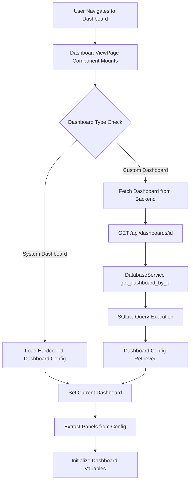
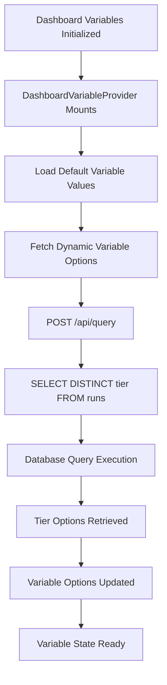
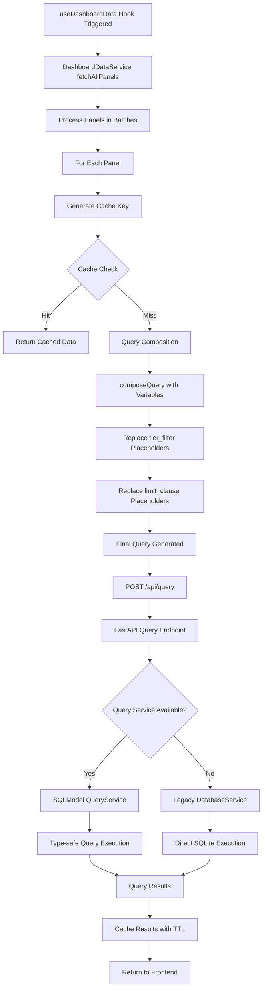
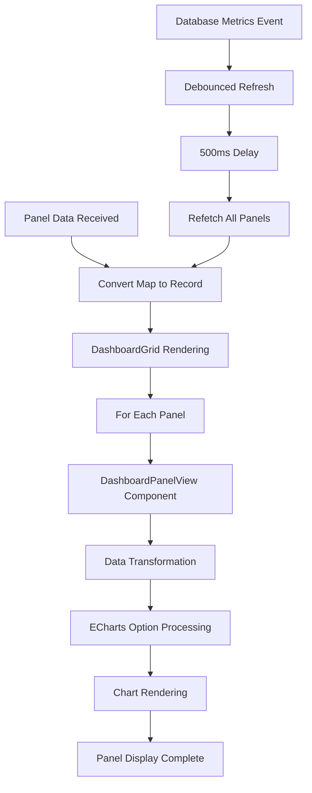

# TowerIQ Dashboard Data Flow Analysis

## Overview

This document provides a comprehensive analysis of the entire data flow process when navigating to and loading a dashboard in TowerIQ. The system employs a sophisticated architecture with React frontend, FastAPI backend, caching mechanisms, debouncing, and dynamic query composition.

## Architecture Components

### Frontend Components
- **React/Tauri GUI**: Primary user interface
- **DashboardViewPage**: Main dashboard component
- **DashboardContext**: Dashboard state management
- **DashboardDataService**: Centralized data fetching with caching
- **DashboardVariableContext**: Variable management and options
- **useDashboardData Hook**: Dashboard-level data fetching
- **DashboardGrid**: Panel rendering and layout

### Backend Components
- **FastAPI API Server** (`api_server.py`): REST API endpoints
- **DatabaseService**: SQLite database operations
- **QueryService**: Type-safe query execution (SQLModel)
- **ConfigurationManager**: Application configuration

## Complete Data Flow Process

### Phase 1: Dashboard Navigation and Loading



### Phase 2: Variable Processing and Options Loading



### Phase 3: Panel Data Fetching with Caching



### Phase 4: Data Processing and Rendering



## Key API Endpoints

### Dashboard Management
- `GET /api/dashboards` - List all dashboards
- `GET /api/dashboards/{id}` - Get specific dashboard
- `POST /api/dashboards` - Create new dashboard
- `PUT /api/dashboards/{id}` - Update dashboard
- `DELETE /api/dashboards/{id}` - Delete dashboard

### Data Querying
- `POST /api/query` - Execute SQL queries with variables
- `POST /api/query/preview` - Preview query execution plan

### Database Operations
- `GET /api/v1/database/statistics` - Get database statistics
- `POST /api/v1/database/collect-metrics` - Trigger metrics collection

## Caching and Performance Optimization

### DashboardDataService Caching
```typescript
interface PanelDataResult {
  data: any[];
  loading: boolean;
  error: string | null;
  timestamp: number;
  cacheHit: boolean;
}
```

**Cache Configuration:**
- **TTL**: 5 minutes (300,000ms)
- **Batch Size**: 6 concurrent requests
- **Delay Between Batches**: 200ms
- **Delay Between Requests**: 100ms
- **Max Retries**: 1 (no retries for quick failure)

**Cache Key Generation:**
```typescript
private generateCacheKey(panelId: string, query: string, variables: Record<string, any>): string {
  const variablesString = JSON.stringify(variables, Object.keys(variables).sort());
  return `${panelId}:${query}:${variablesString}`;
}
```

### Request Deduplication
The service maintains a `pendingRequests` Map to prevent duplicate requests for the same cache key while a request is in flight.

### Debouncing Mechanisms

#### Database Metrics Updates
```typescript
// 500ms debounce for database metrics updates
const handleDatabaseMetricsUpdate = () => {
  clearTimeout(debounceTimer);
  debounceTimer = setTimeout(() => {
    refetch();
  }, 500);
};
```

#### Device Cache
```typescript
// 5-second cache for device discovery
const _device_cache_duration = 5; // seconds
```

## Query Composition and Variable Processing

### Variable Substitution
The `composeQuery` function handles dynamic SQL generation:

```typescript
export function composeQuery(rawQuery: string, variables: Record<string, any>): string {
  let finalQuery = rawQuery;

  // Handle tier filter
  const tierValue = variables.tier;
  if (finalQuery.includes('${tier_filter}')) {
    let tierClause = '';
    if (Array.isArray(tierValue) && tierValue.length > 0 && !tierValue.includes('all')) {
      const safeTiers = tierValue.map(t => typeof t === 'number' ? t : `'${String(t)}'`).join(',');
      tierClause = finalQuery.toLowerCase().includes('where') 
        ? `AND tier IN (${safeTiers})`
        : `WHERE tier IN (${safeTiers})`;
    }
    finalQuery = finalQuery.replace('${tier_filter}', tierClause);
  }

  // Handle limit clause
  const limitValue = variables.num_runs;
  if (finalQuery.includes('${limit_clause}')) {
    let limitClause = '';
    if (limitValue && limitValue !== 'all') {
      limitClause = `LIMIT ${parseInt(String(limitValue), 10)}`;
    }
    finalQuery = finalQuery.replace('${limit_clause}', limitClause);
  }

  return finalQuery.replace(/\s+/g, ' ').trim();
}
```

### Example Query Transformation
**Original Query:**
```sql
SELECT row_number() OVER (ORDER BY start_time ASC) as run_number, round_coins, CPH, tier 
FROM runs ${tier_filter} 
ORDER BY start_time ASC ${limit_clause}
```

**With Variables** `{tier: [1,2], num_runs: 10}`:
```sql
SELECT row_number() OVER (ORDER BY start_time ASC) as run_number, round_coins, CPH, tier 
FROM runs AND tier IN (1,2) 
ORDER BY start_time ASC LIMIT 10
```

## Dashboard Types and Loading

### System Dashboards (Hardcoded)
- **default-dashboard**: TowerIQ Overview
- **database-health-dashboard**: Database Health Metrics
- **live-run-tracking-dashboard**: Live Run Tracking

These are loaded directly from TypeScript configuration files without backend calls.

### Custom Dashboards
Loaded from the database via the dashboard management API endpoints.

## Error Handling and Fallbacks

### Query Execution
1. **Primary**: SQLModel QueryService (type-safe)
2. **Fallback**: Legacy DatabaseService (direct SQLite)
3. **Schema Errors**: Graceful handling with empty results for missing columns

### Retry Logic
```typescript
// Single retry attempt with exponential backoff
for (let attempt = 1; attempt <= this.config.maxRetries; attempt++) {
  try {
    // Execute query
  } catch (error) {
    if (attempt < this.config.maxRetries) {
      await this.delay(this.config.retryDelay * attempt);
    }
  }
}
```

## Performance Characteristics

### Batching Strategy
- Panels processed in batches of 6
- 200ms delay between batches
- 100ms delay between individual requests within a batch

### Memory Management
- Automatic cache cleanup based on TTL
- Pending request map cleanup after completion
- Device cache with 5-second duration

### Event-Driven Updates
- Database metrics updates trigger dashboard refresh
- Manual refresh capability via toolbar
- Automatic refresh intervals (configurable per dashboard)

## Security Considerations

### Query Safety
- Only SELECT statements allowed
- Forbidden keywords: DROP, DELETE, UPDATE, INSERT, CREATE, ALTER, TRUNCATE
- Automatic LIMIT clause injection (500 rows max)
- Variable sanitization in query composition

### Input Validation
- Type checking for dashboard variables
- SQL injection prevention
- Parameter validation for API endpoints

## Configuration and Customization

### DashboardDataService Configuration
```typescript
interface DashboardDataServiceConfig {
  batchSize: number;           // Default: 6
  delayBetweenRequests: number; // Default: 100ms
  delayBetweenBatches: number;  // Default: 200ms
  cacheTTL: number;            // Default: 5 minutes
  maxRetries: number;          // Default: 1
  retryDelay: number;          // Default: 1000ms
}
```

### Environment Configuration
- API base URL configuration
- Database connection settings
- Logging levels and destinations
- Feature flags for dashboard editing

## Monitoring and Debugging

### Development Mode Features
- Cache hit/miss logging
- Query execution timing
- Panel data flow tracing
- Grid layout debugging

### Production Monitoring
- Error tracking for failed queries
- Performance metrics collection
- Database health monitoring
- Automatic backup scheduling

## Conclusion

The TowerIQ dashboard system implements a sophisticated data flow architecture that balances performance, reliability, and user experience. Key strengths include:

1. **Intelligent Caching**: Multi-level caching with TTL and deduplication
2. **Batch Processing**: Optimized request batching to prevent API overload
3. **Dynamic Query Generation**: Flexible variable substitution system
4. **Error Resilience**: Comprehensive fallback mechanisms
5. **Real-time Updates**: Event-driven refresh with debouncing
6. **Security**: Multiple layers of SQL injection protection

This architecture enables responsive dashboard loading while maintaining data consistency and system performance across varying loads and network conditions.
