docs/automated_injection_debugging.md
### Automated Frida Injection Debugging Report

#### Scope
- Baseline: What a successful manual injection looks like (from `fridalog.txt`).
- Automated Flow: How the app currently performs injection.
- Root Cause: Where the automated flow diverges and why it fails.
- Fix: Actionable code edits to resolve the issue.
- Verification: Steps to confirm the fix.
- Diagram: Side-by-side sequence to visualize divergence.

---

### 1) Baseline from the Manual Log (Ground Truth)

Manual command and expected signals:
```text
frida -U "The Tower" -l tower_hook_compiled.js --realm=emulated
```

Observed in `fridalog.txt`:
- Host: Frida CLI shows banner and connects to `Android Emulator 5554`.
- Target: Process resolved by name “The Tower”.
- Script: `tower_hook_compiled.js` (fully packaged output from frida-compile).
- Realm: `--realm=emulated`.

Critical, expected messages:
- Startup logs:
  - “Il2Cpp Bridge is ready and running in the emulated realm.”
  - “Heartbeat initiated...”
  - “Handshake receiver is active...”
  - “Performing proactive check...”
  - Hooks live: `Main.StartNewRound`, `Main.GameOver`, `Main.Pause`, etc.
- Heartbeats every ~15s:
  - `frida_heartbeat` with `isGameReachable: True`.
- Game events and metrics:
  - `Game speed changed...`
  - `New round detected! Seed: ...`
  - `game_event` and `game_metric` payloads throughout the round.
  - `gameOver`, final stats, and “Round over. Resetting state.”

Host/emulator timing:
- Script emits messages immediately after load (no special delays needed).
- Heartbeat at ~15s intervals.
- No ADB steps needed because Frida CLI talks directly to frida-server already running.

Paths and context:
- Host script path: `tower_hook_compiled.js` in working directory.
- Script is the frida-compile packaged artifact (contains packager markers like 📦, ↻, ✄, inlined `frida-il2cpp-bridge` dependency).

---

### 2) Automated Process Trace (App Code)

Entry (user presses Start in UI):
- `src/gui/TowerIQ/src/pages/ConnectionPage.tsx`
  - Finds selected device and process (`com.TechTreeGames.TheTower`), provisions Frida, then:
  - Calls backend to activate the hook with raw script content:
    ```ts
    await activateHook(selectedDevice.id, targetProcess, selectedHookScript.content);
    ```

Backend activation endpoint:
```12:14:src/tower_iq/api_server.py
@app.post("/api/activate-hook")
async def activate_hook(request: HookActivationRequest, background_tasks: BackgroundTasks):
```
- Extracts `pid`, prefers `script_content` from UI, else loads from disk.
- Calls Frida service:
```397:405:src/tower_iq/api_server.py
success = await controller.frida_service.inject_and_run_script(
    device_id=device_id, pid=pid, script_content=script_content
)
```

Frida injection flow:
```480:493:src/tower_iq/services/frida_service.py
# Try native attach+inject, else fallback to CLI
if await self.attach(pid, device_id):
    if await self.inject_script(script_content):
        return True
    await self.detach()
# Fallback
cli_ok = await self._run_script_via_cli(pid=pid, script_content=script_content)
```

Native injection does:
- Attach with `realm='emulated'`:
```173:193:src/tower_iq/services/frida_service.py
session = device.attach(pid, realm='emulated')
```
- Injects content after “sanitizing”:
```374:381:src/tower_iq/services/frida_service.py
script_to_load = self._sanitize_script_content(script_content)
script = session.create_script(script_to_load)
script.on('message', self._on_message)
script.load()
```

Sanitizer trims packager header:
```440:467:src/tower_iq/services/frida_service.py
header_markers = ("📦", "↻", "✄")
has_header_marker = any(m in content[:200] for m in header_markers)
meta_idx = content.find("/** TOWERIQ_HOOK_METADATA")
if meta_idx != -1 and has_header_marker:
    trimmed = content[meta_idx:]
    return trimmed
```

CLI fallback (if native fails) runs:
```523:528:src/tower_iq/services/frida_service.py
frida -U -p PID -l <tmp_path> --realm=emulated
```

The actual compiled script is packaged:
```1:8:tower_hook_compiled.js
📦
... /node_modules/frida-il2cpp-bridge/dist/index.js
↻ frida-il2cpp-bridge
✄
/** TOWERIQ_HOOK_METADATA
...
```

---

### 3) Discrepancy and Root Cause

- Manual success uses the fully packaged `tower_hook_compiled.js` (packager prelude + inlined `frida-il2cpp-bridge`) and attaches correctly. This produces the expected Il2Cpp log, heartbeat, and game data.
- Automated flow diverges at injection:
  - The sanitizer removes the packager prelude when it detects 📦/↻/✄ before metadata.
  - That trimmed content starts at the metadata block and contains:
    - The statement: `import "frida-il2cpp-bridge";`
    - But the inlined module and packager runtime (before metadata) were just removed.
  - Result: The injected script cannot resolve `frida-il2cpp-bridge` and fails to run, yielding no initialization logs, no heartbeat, and no game data.

Why this only shows up in automation:
- The CLI in manual mode loads the full bundled file and understands the packager format.
- The automated native injection feeds sanitized, broken content into `create_script`, stripping the packager runtime needed by the compiled script.
- If native injection returns True (script.load succeeded), the script can still crash at runtime (import unresolved), producing no usable messages.
- Even if it falls back to CLI, the backend currently starts the CLI runner but returns success immediately; if the script is malformed (or using mismatched content), it yields no useful messages for the backend to parse and store.

Conclusion: The sanitizer is the point of divergence; it removes the necessary packager prelude, breaking the compiled script’s module resolution. This explains no Il2Cpp init, no heartbeat, and no game data in automated runs.

---

### 4) Actionable Recommendations (Edits)

Minimal, safe fix: Preserve packaged scripts intact.
- Detect frida-compile packaging markers and do not sanitize.
- This preserves the inlined `frida-il2cpp-bridge` module and matches the manual behavior.

Edit 1: Only sanitize non-packaged scripts
```python
# src/tower_iq/services/frida_service.py

# In inject_script(), replace:
script_to_load = self._sanitize_script_content(script_content)

# With:
has_packaging = any(m in script_content[:200] for m in ("📦", "↻", "✄"))
script_to_load = script_content if has_packaging else self._sanitize_script_content(script_content)
```

Optional Edit 2: Harden fallback for packaged scripts (forces exact manual parity)
- If packaging is detected, skip native injection entirely and run via CLI with unchanged content (the same way you run manually). This avoids any Python-API parsing differences.
```python
# src/tower_iq/services/frida_service.py

async def inject_and_run_script(self, device_id: str, pid: int, script_content: str) -> bool:
    self.logger.info("Starting inject and run workflow", device_id=device_id, pid=pid)
    try:
        has_packaging = any(m in script_content[:200] for m in ("📦", "↻", "✄"))
        if has_packaging:
            # Use CLI exactly like manual
            if await self._run_script_via_cli(pid=pid, script_content=script_content):
                self.logger.info("CLI frida runner started successfully (packaged script)")
                return True
            self.logger.error("CLI frida runner failed to start (packaged script)")
            return False

        # Non-packaged: try native, then CLI fallback
        if await self.attach(pid, device_id):
            if await self.inject_script(script_content):
                self.logger.info("Inject and run workflow completed successfully")
                return True
            self.logger.warning("Native injection failed, falling back to frida CLI runner")
            await self.detach()

        self.logger.warning("Attach failed or not attempted, trying CLI runner")
        return await self._run_script_via_cli(pid=pid, script_content=script_content)
    except Exception as e:
        self.logger.error("Error in inject and run workflow", error=str(e))
        await self.detach()
        return False
```

Recommended structural improvement (aligns with your memory that frontend should only send the selection, not raw content [[memory:7615778]]):
- Change API to accept script ID or filename only, and have the backend read the exact file from disk. This guarantees the packaged content (and path) matches what you run manually and avoids corruption during transport.
- Frontend: send just `script_id` (or `fileName`), not `content`.
- Backend (`/api/activate-hook`): load the file via `HookScriptManager.get_script_content(fileName)` and pass the raw string into injection.

Example (API change sketch):
```python
# src/tower_iq/api_server.py
# Prefer ID or fileName; stop passing raw content from UI
if request.script_content:
    logger.warning("script_content supplied by UI; prefer backend-loaded file content for reliability")
else:
    # Load from disk by id/name
    script_content = await controller._load_script_by_id(script_id) if script_id else \
                     await controller._load_script_by_name(script_name, package_name, version)
```

---

### 5) Verification Plan

After implementing Edit 1 (and optional Edit 2):

1) Start app, connect device, ensure `frida-server` is running via the Provision/Start buttons or API.
2) Start hook from UI (select the packaged `tower_hook_compiled.js` script entry).
3) Confirm logs:
   - Expect “Il2Cpp Bridge is ready and running in the emulated realm.”
   - Expect heartbeat logs every ~15s.
   - Expect `game_event` and `game_metric` entries during gameplay.
4) Confirm database writes (use your dashboards or query recent events/metrics).
5) If still no logs:
   - Force CLI path by enabling optional Edit 2 (packaged -> CLI).
   - Ensure `frida` CLI is in PATH (run `frida --version`).

---

### 6) Mermaid Sequence Diagram (Manual vs Automated)

```mermaid
sequenceDiagram
    autonumber
    participant U as User
    participant H as Host (CLI/App)
    participant A as Android Emulator
    participant F as frida-server
    participant G as Game ("The Tower")

    rect rgb(230,255,230)
    note over U,H: Manual Flow (Working)
    U->>H: Run: frida -U "The Tower" -l tower_hook_compiled.js --realm=emulated
    H->>F: Connect via USB (-U)
    H->>G: Attach by name ("The Tower")
    H->>G: Load packaged script (packager header intact)
    G-->>H: send hook_log: Il2Cpp bridge ready
    G-->>H: send hook_log: Heartbeat initiated
    G-->>H: send game_event/game_metric (rounds, waves, coins, etc.)
    end

    rect rgb(255,240,240)
    note over U,H: Automated Flow (Failing)
    U->>H: Click Start in UI
    H->>F: Provision/start frida-server
    H->>G: Attach by PID (realm=emulated)
    H->>G: Load script_content (sanitized)  %% Divergence
    note right of H: Sanitizer strips packager prelude (📦,↻,✄)
    note right of G: import "frida-il2cpp-bridge" fails (module now missing)
    G-->>H: (no Il2Cpp ready, no heartbeat, no data)
    end

    critical Divergence
    H-xG: Removing packager prelude breaks runtime imports
    end
```



Color legend:
- Green block: successful manual flow.
- Red block: failing automated flow.
- Critical: exact point of divergence.

---