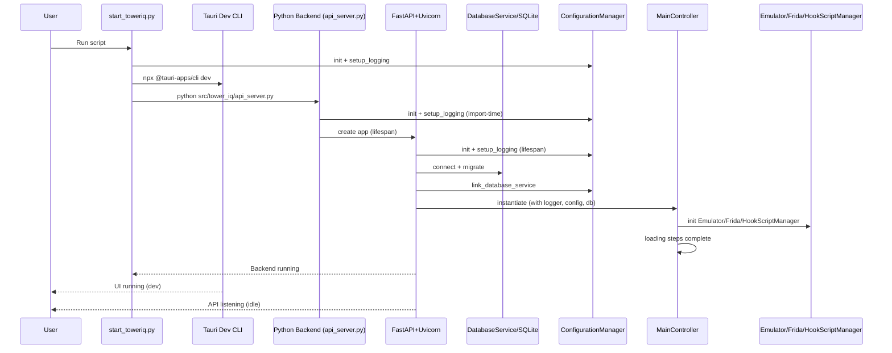

# TowerIQ Startup Analysis and Recommendations

This document provides an end‑to‑end review of TowerIQ’s startup flow, traced from the entrypoint through service initialization to its idle (ready) state. It includes a sequence diagram, phase breakdown, in‑depth analysis, and actionable improvements with code examples.

## Overview

- Entrypoint: `start_toweriq.py` launches both the Tauri frontend and the FastAPI backend (as separate subprocesses), configures logging, and monitors both processes.
- Backend: `src/tower_iq/api_server.py` defines a FastAPI app with a lifespan context that initializes configuration, logging, SQLite, and the main controller (Emulator, Frida, scripts), then begins serving.
- Idle state: Uvicorn listens for requests on `127.0.0.1:8000` and the Tauri dev UI runs at `http://localhost:1420`.

## Startup Flow (Step‑by‑Step)

1) `start_toweriq.py` initializes `ConfigurationManager` and calls `setup_logging(config)`, then rebinds the config logger via `config._recreate_logger()`.
2) `start_tauri_frontend()` starts `npx @tauri-apps/cli dev` in `src/gui/TowerIQ` (running `npm install` if `node_modules` is missing).
3) `start_backend_server()` launches `python src/tower_iq/api_server.py` as a subprocess.
4) Importing `api_server.py` configures logging once (at import) and again inside `lifespan` (runtime) and builds the FastAPI app.
5) In `lifespan(app)`: chdir to project root, re‑create `ConfigurationManager`, call `setup_logging(config)`, initialize SQLite (`DatabaseService.connect()` + migrations), link DB to config (`config.link_database_service(db_service)`), instantiate `MainController` (Session, Emulator, Frida, Hook scripts), mark loading steps complete, then signal ready.
6) Uvicorn serves; app is idle and ready for requests. The launcher monitors both frontend and backend and cleans up on shutdown.

## Mermaid Diagram (Startup Sequence)



## Key Startup Phases

- Configuration & Logging
  - YAML: `config/main_config.yaml` provides system defaults and paths.
  - DB overlay: `ConfigurationManager.link_database_service()` merges user settings and logs type issues.
  - Logging: `setup_logging(config)` creates a structlog pipeline with colored console, rotating JSON file handler, and optional SQLite log handler.

- Backend App Setup
  - FastAPI app with lifespan, CORS for Tauri dev origins (localhost:1420), and routes for health, Frida operations, devices, dashboards, and safe SQL preview/exec.

- Database Initialization
  - SQLite WAL mode, schema creation/migration to V2 (`runs`, `metrics` long‑format, `events`, `logs`, `settings` with metadata, `dashboards`).

- Service Composition
  - `MainController` composes `SessionManager` (PyQt6 signals/mutex), `EmulatorService` (ADB + Frida server manager), `FridaService` (message queue, attach/detach, heartbeat integration), and `HookScriptManager` (discovers `.js` scripts and loads content).

- Ready/Idle
  - Loading steps marked complete; FastAPI/Uvicorn serves; frontend dev UI runs.

## In‑Depth Analysis

- Initialization Order & Dependencies
  - Duplicate logging initialization in backend: `api_server.py` configures logging at import and again in `lifespan`. This risks drift and redundant setup. Prefer initializing only in `lifespan` (after config and DB are ready), and avoid import‑time side effects.
  - Configuration managers are instantiated in both launcher and backend. This is okay but consider centralizing path/env overrides to prevent drift.
  - DB is connected before linking to config (correct order), enabling user setting overlay.

- Configuration Management
  - Layered YAML + DB approach is solid. No hardcoded secrets found. Sensitive flag (`is_sensitive`) exists but values are logged when settings are saved.
  - Add environment overrides for config path and run modes (e.g., `TOWERIQ_CONFIG_PATH`, `TOWERIQ_ENV`) for deployment flexibility.

- Error Handling & Resilience
  - Health check unused: `check_backend_health()` exists but the frontend starts before backend readiness. This can cause first‑run UI errors.
  - DB startup: If SQLite is locked, startup fails. Consider short, bounded retries on lock errors.
  - API endpoints: Good guardrails (CORS limited to dev origin; SQL endpoints only allow SELECT and block dangerous tokens).

- Performance
  - Hard sleep during backend startup (`await asyncio.sleep(2)`) slows cold start unnecessarily. Remove or make dev‑only.
  - Script discovery runs at startup; defer to first use to shave startup time marginally.
  - Tauri dependency bootstrap installs `node_modules` when missing—necessary but heavy; current logs are clear.

- Security
  - Logging of sensitive settings: avoid logging raw values for sensitive keys; mask them.
  - Subprocess working directory: prefer `cwd` in subprocess calls over `os.chdir` to avoid global side effects.

- Code Quality & Maintainability
  - Import‑time side effects: avoid (especially logging init). Initialize within `lifespan` or an app factory.
  - Centralize bootstrap: extract shared `load_config()` and `init_logging()` helpers to remove duplication.
  - Backend’s `SessionManager` uses PyQt6; for headless server deployments, consider a lightweight session alternative or dependency gate.

## Actionable Recommendations (with Examples)

### 1) Backend logging: remove import‑time setup, initialize in `lifespan`

- Issue: Logging is configured at import and again at runtime.
- Fix: Move uvicorn logger propagation to `lifespan` after calling `setup_logging(config)`. Remove module‑level `configure_logging()` call.

```python
# src/tower_iq/api_server.py (sketch)
# Remove: config = configure_logging() at module scope

async def lifespan(app: FastAPI):
    app_root = Path(__file__).parent.parent.parent
    os.chdir(app_root)

    config_path = os.environ.get("TOWERIQ_CONFIG_PATH", str(app_root / 'config' / 'main_config.yaml'))
    config = ConfigurationManager(config_path)
    setup_logging(config)

    # adjust uvicorn loggers here (not at import)
    import logging
    for name in ("uvicorn", "uvicorn.error", "uvicorn.access", "uvicorn.asgi"):
        lg = logging.getLogger(name)
        lg.handlers = []
        lg.propagate = True

    # ... DB connect, link config, controller init
    yield
```

### 2) Start backend first and wait for health before enabling frontend

- Issue: Frontend starts before backend is ready; `check_backend_health()` is unused.
- Fix: Start backend first, wait for health, then start Tauri; or keep the splash but have UI poll `/api/status` before interacting.

```python
# start_toweriq.py (sketch)
backend_process = start_backend_server()
if not backend_process:
    logger.error("Failed to start backend server. Exiting.")
    return 1

if not check_backend_health("http://127.0.0.1:8000/"):
    logger.error("Backend did not become healthy. Exiting.")
    return 1

frontend_process = start_tauri_frontend()
if not frontend_process:
    logger.error("Failed to start Tauri frontend. Exiting.")
    return 1
```

### 3) Mask sensitive values when saving settings

- Issue: `ConfigurationManager.set()` logs raw values.
- Fix: Mask sensitive values in logs.

```python
# src/tower_iq/core/config.py (inside set())
# ... after computing is_sensitive and before logging
log_value = '***' if is_sensitive or self._setting_metadata.get(key, {}).get('is_sensitive') else value
self.logger.debug("Setting saved to database", key=key, value=log_value, value_type=value_type)
```

### 4) Avoid global chdir; use subprocess `cwd`

- Issue: `start_tauri_frontend()` changes global working directory.
- Fix: Pass `cwd=str(tauri_dir)` and remove `os.chdir` calls.

```python
# start_toweriq.py (sketch)
process = subprocess.Popen([npx_cmd, "@tauri-apps/cli", "dev"], cwd=str(tauri_dir), text=True)
```

### 5) Remove or gate startup sleep in backend

- Issue: `await asyncio.sleep(2)` slows startup.
- Fix: Remove or guard behind a dev flag.

```python
# src/tower_iq/api_server.py (lifespan)
if config.get('system_defaults.dev_mode', False):
    await asyncio.sleep(2)
```

### 6) Add environment overrides for configuration path

- Issue: Config path hardcoded; harder to deploy in varied environments.
- Fix: Respect `TOWERIQ_CONFIG_PATH` in both launcher and backend.

```python
# start_toweriq.py (sketch)
app_root = Path(__file__).parent
config_path = os.environ.get("TOWERIQ_CONFIG_PATH", str(app_root / 'config' / 'main_config.yaml'))
config = ConfigurationManager(config_path)
setup_logging(config)
```

### 7) Optional: Retry SQLite connection on lock

- Issue: WAL lock can cause startup failures.
- Fix: Add short, bounded retries around `sqlite3.connect` exceptions.

```python
# src/tower_iq/services/database_service.py (sketch)
for attempt in range(3):
    try:
        self.sqlite_conn = sqlite3.connect(self.db_path, check_same_thread=False)
        break
    except sqlite3.OperationalError as e:
        if 'locked' in str(e).lower() and attempt < 2:
            time.sleep(0.5 * (attempt + 1))
            continue
        raise
```

## Overall Health Summary

- Strengths
  - Clear separation of launcher vs backend; explicit service wiring.
  - Solid logging pipeline and database initialization with migrations.
  - Safe API defaults (CORS limited to dev; SQL endpoints guarded).

- Improvement Areas
  - Remove import‑time logging setup; initialize once in `lifespan`.
  - Gate frontend on backend health to avoid UI race conditions.
  - Mask sensitive values in config logs.
  - Replace `chdir` with subprocess `cwd`; remove dev‑only startup sleep.
  - Consider env overrides and optional SQLite retry.

With these changes, startup becomes more robust, faster, and easier to deploy and maintain.

